  

  <h1>Olá, eu sou o Lucca! 👋</h1>
  

    <b>Analista de Dados & Negócio | XP Inc. | Estudante de SI @ USP</b> 
    <i>Transformando dados complexos em decisões estratégicas e insights valiosos.</i>
  

  

    
    
  

---

### 🚀 Sobre Mim

Atualmente atuo na área de **People Analytics na XP Inc.**, onde utilizo tecnologia para otimizar processos e entender o capital humano. Sou fascinado pela intersecção entre **Tecnologia, Negócios e Dados**. No tempo livre, estou explorando novas arquiteturas de cloud e aprimorando minhas habilidades em engenharia de dados.

---

### 📊 Dashboard de Performance

  

---

### 🛠 Minha Tech Stack

| Categoria | Ferramentas |
| :--- | :--- |
| **Análise & Processamento** |     |
| **Visualização** |   |
| **Cloud & Infra** |    |
| **Linguagens Base** |   |

---

### 🎨 GitHub Insights (Metrics)

  

---

### 🐍 Contribuições

  

 

  

---

  Matriculado em Sistemas de Informação na <b>USP - Universidade de São Paulo</b> 🎓

